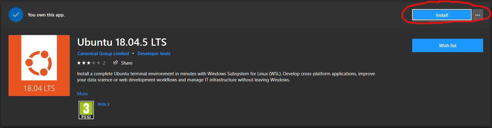
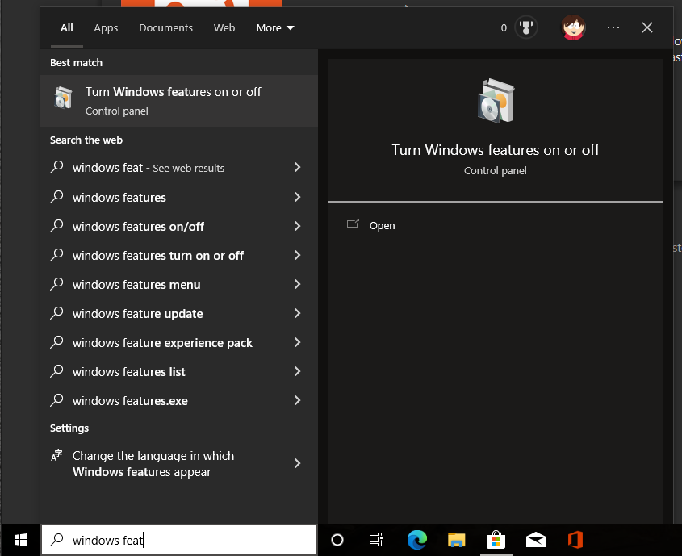
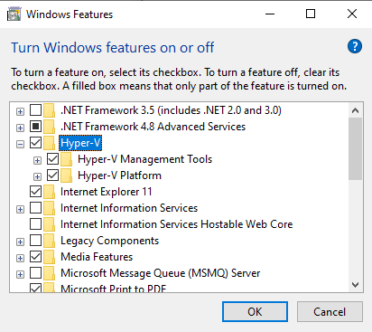
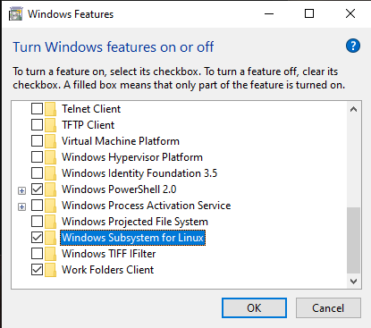
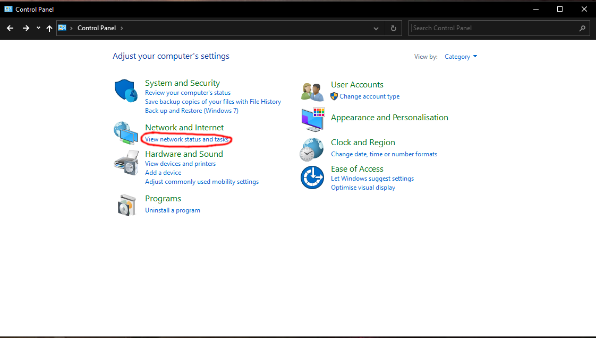
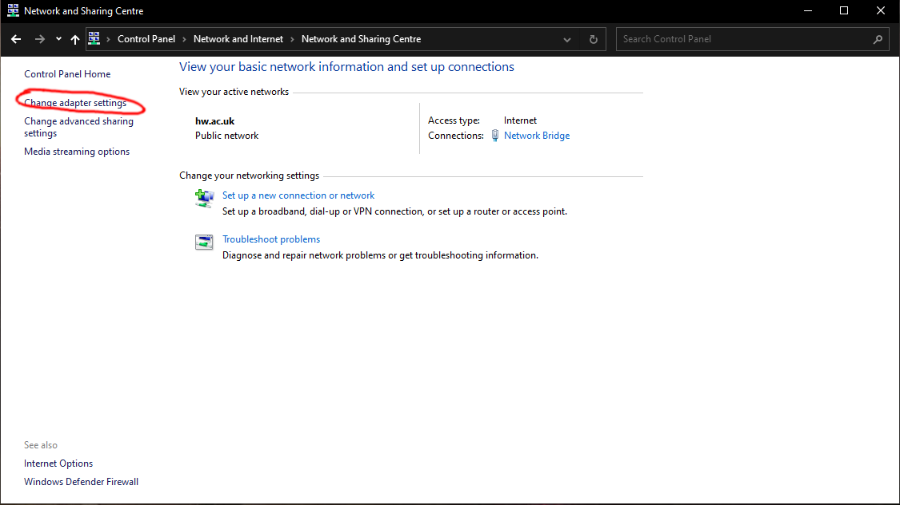
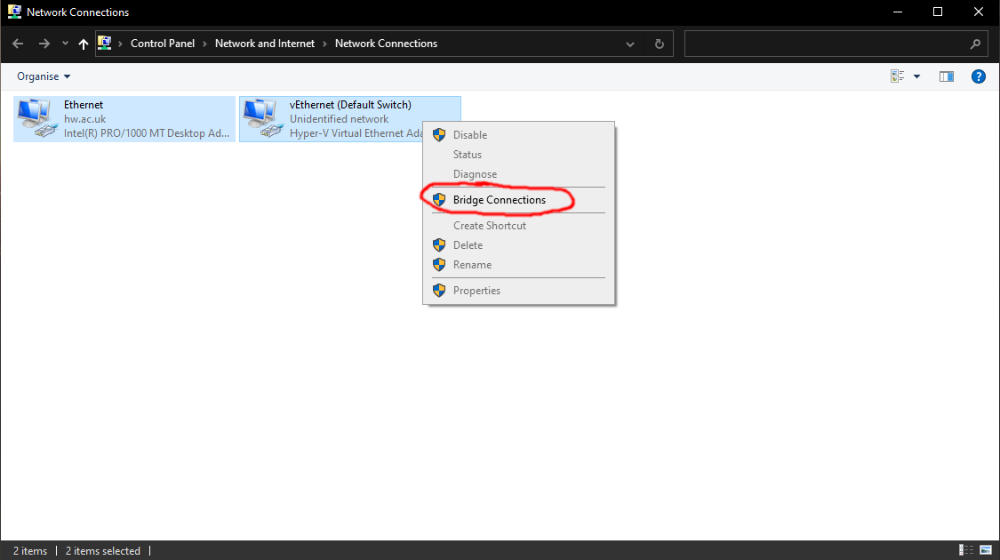
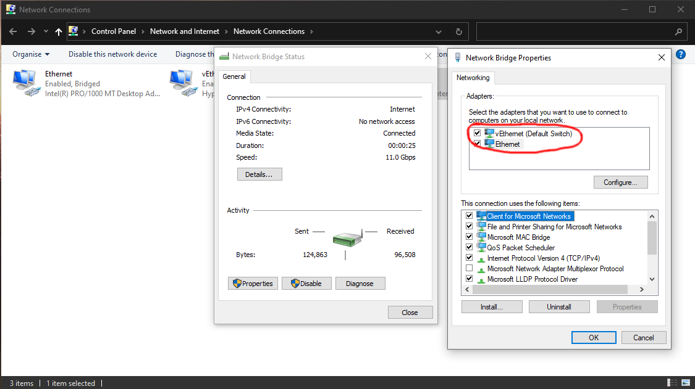

# ROS on windows
To be able to use ROS on windows we will use WSL which is a native tool of windows allowing to create Linux virtual machines on Windows which are well integrated.

The first step is to install Ubuntu, to do this go to the windows store and download Ubuntu 18.04 (version adapted for ROS melodic).



Then you have to activate the virtualization function of windows. For that launch Windows Features from the start menu and activate **"Hyper-v"** and **"Windows Subsystem for Linux"**.







Once your computer is rebooted you can launch Ubuntu 18.04 from the start menu. You will have to enter a username and a password.

Next we will create a network bridge between your network card and the virtual network card of WSL, to do this open the control panel and select **"View network status and tasks"** then **"Change adapter settings"**.





Then select the interface with which you are connected to the network (wifi or ethernet) and the virtual interface of WSL **"vEthernet"** then right click and *"Bridge connection"*.



Check in the properties of your network bridge that the two interfaces are well connected.



Once the bridge is created and functional you can open Ubuntu 18.04, run this script to configure an IP address in this way: 

```bash
chmod +x setup.bash
./setup.bash <IP Adress> <Gateway>
```

You must select a free IP Adress.

This script must be run at each WSL reboot. You can now install ROS as if you are on a normal linux computer using this [tutorial](http://wiki.ros.org/melodic/Installation/Ubuntu).